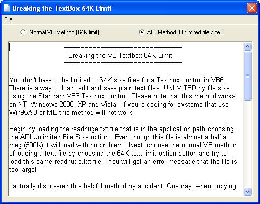

<div align="center">

## Breaking the Textbox 64K File Size Limit \(UPDATE: Sept\. 15th, 2007\)


</div>

### Description

You don't have to be limited to 64K size files for a for a standard Textbox control in VB6. This small sample project shows you how to load, edit and save plain text files, UNLIMITED by file size using the Standard VB6 Textbox control. It's all done in just a few simple lines of code. Please note that this method works on NT, Windows 2000, XP and Vista. If you're coding for systems that use Win95/98 or ME this method will not work.  View the readhuge.txt file for full details. (UPDATE: Changed method from Clipboard method to an API method which is even more efficient and does not mess with any data in the clipboard and the end result is the same.  Thanks to Kenneth Buckmaster and Rob C. for their input.)
 
### More Info
 
Method works in NT, 2000, XP and Vista. Does not work in Win85/98 or ME


<span>             |<span>
---                |---
**Submitted On**   |2007-09-14 20:39:14
**By**             |[Tom Moran](https://github.com/Planet-Source-Code/PSCIndex/blob/master/ByAuthor/tom-moran.md)
**Level**          |Beginner
**User Rating**    |5.0 (45 globes from 9 users)
**Compatibility**  |VB 5\.0, VB 6\.0
**Category**       |[Files/ File Controls/ Input/ Output](https://github.com/Planet-Source-Code/PSCIndex/blob/master/ByCategory/files-file-controls-input-output__1-3.md)
**World**          |[Visual Basic](https://github.com/Planet-Source-Code/PSCIndex/blob/master/ByWorld/visual-basic.md)
**Archive File**   |[Breaking\_t2083369142007\.zip](https://github.com/Planet-Source-Code/tom-moran-breaking-the-textbox-64k-file-size-limit-update-sept-15th-2007__1-69294/archive/master.zip)

### API Declarations

```
'API's and Const to load large files
  Private Declare Function SendMessage Lib "user32" _
   Alias "SendMessageA" (ByVal hwnd As Long, ByVal wMsg As Long, _
   ByVal wParam As Long, lParam As Any) As Long
  Private Declare Function GetWindowTextLength Lib "user32" _
   Alias "GetWindowTextLengthA" (ByVal hwnd As Long) As Long
  Private Const WM_SETTEXT = &amp;HC
  Private Const WM_GETTEXT = &amp;HD
  Private Const WM_GETTEXTLENGTH = &amp;HE
```


